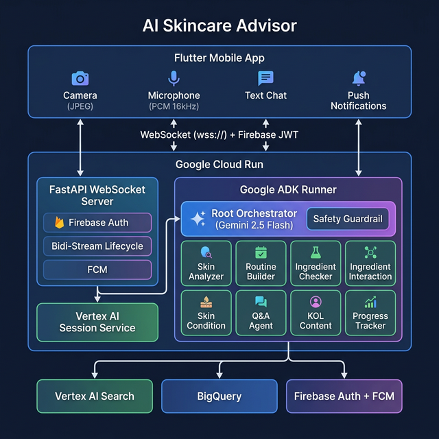

# 🧴 AI Skincare Advisor

> **A real-time multimodal AI skincare consultation agent** — talk to it, show it your skin, and get personalized advice powered by Gemini Live API and Google ADK.

**Category**: Live Agents 🗣️ | **Hackathon**: #GeminiLiveAgentChallenge

---

## 🎯 What It Does

AI Skincare Advisor is a mobile app that provides **real-time voice + video skincare consultations**. Users can:

- **Talk naturally** to the AI advisor with real-time audio streaming
- **Show their skin** via camera — the AI analyzes conditions in real-time
- **Get interrupted** mid-response — graceful interruption handling built-in
- **Receive personalized routines** based on skin type, concerns, and goals
- **Check ingredient safety** — verify product ingredients and interactions
- **Track progress** — compare skin conditions over time
- **Browse KOL recommendations** — curated content from skincare influencers

The app seamlessly transitions from **live voice/video consultation** to **text chat**, preserving the full conversation transcript.

---

## 🏗️ Architecture



<details>
<summary>Text version (click to expand)</summary>

```
┌─────────────────────────────────────────────────────────────────┐
│                      Flutter Mobile App                         │
│  ┌──────────┐  ┌──────────────┐  ┌───────────┐  ┌───────────┐ │
│  │  Camera   │  │ Microphone   │  │ Text Chat │  │  FCM Push │ │
│  │ (JPEG 1fps│  │(PCM 16kHz)   │  │  Messages │  │  Notifs   │ │
│  └─────┬─────┘  └──────┬───────┘  └─────┬─────┘  └─────┬─────┘ │
│        │               │               │               │       │
│        └───────────────┴───────────────┴───────┬───────┘       │
│                                                │               │
│                    WebSocket (wss://)           │               │
│                    + Firebase JWT Auth          │               │
└────────────────────────────┬───────────────────────────────────┘
                             │
                             ▼
┌─────────────────────────────────────────────────────────────────┐
│                    Google Cloud Run                              │
│  ┌──────────────────────────────────────────────────────────┐  │
│  │              FastAPI WebSocket Server                     │  │
│  │  ┌─────────────┐  ┌──────────────┐  ┌────────────────┐  │  │
│  │  │ Firebase JWT │  │ Bidi-Stream  │  │ FCM Push       │  │  │
│  │  │ Auth Verify  │  │ Lifecycle    │  │ Notifications  │  │  │
│  │  └─────────────┘  └──────┬───────┘  └────────────────┘  │  │
│  └──────────────────────────┼───────────────────────────────┘  │
│                             │                                   │
│  ┌──────────────────────────▼───────────────────────────────┐  │
│  │              Google ADK Runner                            │  │
│  │  ┌────────────────────────────────────────────────────┐  │  │
│  │  │         Root Orchestrator (Gemini 2.5 Flash)        │  │  │
│  │  │              + Safety Guardrail Callback            │  │  │
│  │  └────────────────────┬───────────────────────────────┘  │  │
│  │                       │ AgentTool (x8)                    │  │
│  │  ┌────────┬───────────┼───────────┬───────────┐          │  │
│  │  ▼        ▼           ▼           ▼           ▼          │  │
│  │ Skin    Routine   Ingredient  Ingredient   Skin         │  │
│  │Analyzer Builder    Checker   Interaction  Condition     │  │
│  │  │        │          │           │           │           │  │
│  │  ▼        ▼          ▼           ▼           ▼           │  │
│  │ Q&A    KOL Content  Progress                             │  │
│  │ Agent    Agent       Tracker                             │  │
│  └──────────────────────────────────────────────────────────┘  │
│                             │                                   │
│  ┌──────────────────────────▼───────────────────────────────┐  │
│  │         Vertex AI Session Service                         │  │
│  │         (Persistent Managed Sessions)                     │  │
│  └──────────────────────────────────────────────────────────┘  │
└─────────────────────────────────────────────────────────────────┘
                             │
              ┌──────────────┼──────────────┐
              ▼              ▼              ▼
     ┌──────────────┐ ┌───────────┐ ┌──────────────┐
     │  Vertex AI    │ │ BigQuery  │ │   Firebase   │
     │  Search       │ │ (KOL Data)│ │  Auth + FCM  │
     │  (Datastores) │ │           │ │              │
     └──────────────┘ └───────────┘ └──────────────┘
```

</details>

## 🛠️ Tech Stack

| Layer | Technology |
|---|---|
| **AI Model** | Gemini 2.5 Flash (via ADK) |
| **Agent Framework** | Google ADK (Agent Development Kit) |
| **Streaming** | Gemini Live API — bidi-streaming via `LiveRequestQueue` |
| **Backend** | FastAPI + Uvicorn on **Google Cloud Run** |
| **Sessions** | `VertexAiSessionService` (persistent, managed) |
| **Authentication** | Firebase Auth (Google Sign-In) |
| **Push Notifications** | Firebase Cloud Messaging (FCM) |
| **Search** | Vertex AI Search (skincare knowledge datastores) |
| **Data** | BigQuery (KOL content, product data) |
| **Frontend** | Flutter (Android) — camera, mic, real-time UI |
| **CI/CD** | GitHub Actions (APK build + Firebase App Distribution) |

---

## 🤖 Multi-Agent System

The root orchestrator coordinates **8 specialist agents**, each with focused expertise:

| Agent | Purpose | Key Tools |
|---|---|---|
| 🔬 **Skin Analyzer** | Analyzes skin from camera images | `save_analysis_to_state` |
| 📋 **Routine Builder** | Creates personalized skincare routines | Vertex AI Search |
| 🧪 **Ingredient Checker** | Verifies ingredient safety & efficacy | Vertex AI Search |
| ⚠️ **Ingredient Interaction** | Checks for harmful ingredient combinations | Vertex AI Search |
| 🩺 **Skin Condition** | Identifies and explains skin conditions | Vertex AI Search |
| ❓ **Q&A Agent** | Answers general skincare questions | Vertex AI Search |
| 🌟 **KOL Content** | Recommends influencer-curated content | BigQuery + Vertex AI Search |
| 📊 **Progress Tracker** | Tracks skin improvements over time | `get_progress_summary` |

A **safety guardrail** (`before_model_callback`) screens inputs and redirects medical diagnosis/prescription requests to healthcare professionals.

---

## 🚀 Quick Start

### Prerequisites

- Python 3.11+
- Flutter SDK 3.29+
- Google Cloud project with billing enabled
- Firebase project linked to GCP

### 1. Clone & Install Backend

```bash
git clone https://github.com/muhammad1azmi/AI_Skincare_Advisor.git
cd AI_Skincare_Advisor

# Create virtual environment
python -m venv .venv
source .venv/bin/activate  # Windows: .venv\Scripts\activate

# Install dependencies
pip install -r requirements.txt
```

### 2. Configure Environment

Create `.env` in the project root:

```env
GOOGLE_CLOUD_PROJECT=your-project-id
GOOGLE_CLOUD_LOCATION=us-central1
GOOGLE_GENAI_USE_VERTEXAI=TRUE
AGENT_ENGINE_ID=your-agent-engine-id
```

### 3. Run Backend Locally

```bash
# Skip auth for local dev
export SKIP_AUTH=true

# Start the server
uvicorn server.main:app --host 0.0.0.0 --port 8080 --reload
```

The WebSocket endpoint will be available at `ws://localhost:8080/ws/{user_id}/{session_id}`.

### 4. Run Flutter App

```bash
cd frontend/flutter_app

# Install dependencies
flutter pub get

# Run on Android device/emulator
flutter run

# Or build APK
flutter build apk --release
```

For local development, update `lib/config.dart` to point to `ws://YOUR_LOCAL_IP:8080`.

---

## ☁️ Deploy to Google Cloud

### Backend → Cloud Run

```bash
# Deploy from project root
gcloud run deploy skincare-advisor \
  --source=. \
  --region=us-central1 \
  --project=your-project-id \
  --allow-unauthenticated \
  --set-env-vars="GOOGLE_GENAI_USE_VERTEXAI=TRUE,GOOGLE_CLOUD_PROJECT=your-project-id,GOOGLE_CLOUD_LOCATION=us-central1,AGENT_ENGINE_ID=your-engine-id"
```

### Frontend → APK via GitHub Actions

Push to `main` branch triggers automatic APK build and Firebase App Distribution:

```bash
git push origin main
# → GitHub Actions builds APK → Firebase App Distribution → Testers get notified
```

Required GitHub Secrets:
- `FIREBASE_APP_ID` — Your Firebase Android app ID
- `FIREBASE_SERVICE_ACCOUNT` — Firebase service account JSON key

---

## 📁 Project Structure

```
AI_Skincare_Advisor/
├── app/skincare_advisor/          # ADK Agent system
│   ├── agent.py                   # Root orchestrator (Gemini 2.5 Flash)
│   ├── sub_agents/                # 8 specialist agents
│   ├── tools/                     # Custom tools (skin analysis, progress)
│   ├── prompts/                   # Agent instruction prompts
│   └── tests/                     # ADK evaluation tests
├── server/                        # FastAPI backend
│   ├── main.py                    # WebSocket bidi-streaming server
│   ├── auth.py                    # Firebase JWT verification
│   └── notifications.py           # FCM push notifications
├── frontend/flutter_app/          # Flutter mobile app
│   ├── lib/
│   │   ├── screens/               # Chat, Consultation, Home, Profile, etc.
│   │   ├── services/              # WebSocket, Auth, Audio, Camera, Notifications
│   │   ├── config.dart            # Backend URL configuration
│   │   └── main.dart              # App entry point
│   └── android/                   # Android platform config
├── .github/workflows/             # CI/CD
│   └── build-apk.yml              # APK build + Firebase distribution
├── Dockerfile                     # Cloud Run container
├── requirements.txt               # Python dependencies
└── README.md                      # This file
```

---

## 🔒 Security

- **Firebase Auth** — Google Sign-In with JWT verification on every WebSocket connection
- **No hardcoded secrets** — All credentials via environment variables
- **Non-root container** — Cloud Run runs as `appuser`
- **Safety guardrail** — Rejects medical diagnosis/prescription requests
- **CORS restricted** — Only allowed origins

---

## 📊 Evaluation

The project includes ADK evaluation tests covering:

- **Routing accuracy** — Does the orchestrator pick the right specialist?
- **Safety guardrails** — Are medical requests properly deflected?
- **Response quality** — Are skincare recommendations relevant and helpful?

Run evaluations:
```bash
cd app
python -m pytest skincare_advisor/tests/ -v
```

---

## 🏆 Hackathon Highlights

| Criteria | How We Excel |
|---|---|
| **Multimodal I/O** | Camera (vision) + Microphone (audio) + Text → Voice + Text responses |
| **Live API** | Gemini Live API with bidi-streaming, real-time transcription |
| **Interruptible** | `LiveRequestQueue` handles user interruptions mid-response |
| **Multi-Agent** | 8 specialist agents via AgentTool — not a single monolithic agent |
| **Google Cloud** | Cloud Run + Vertex AI + BigQuery + Firebase + Vertex AI Search |
| **Production-Ready** | CI/CD pipeline, auth, push notifications, persistent sessions |
| **Safety** | Before-model callback screens for out-of-scope medical requests |

---

## 📄 License

MIT

---

*Built with ❤️ using Google ADK, Gemini 2.5 Flash, and Google Cloud for the #GeminiLiveAgentChallenge*
